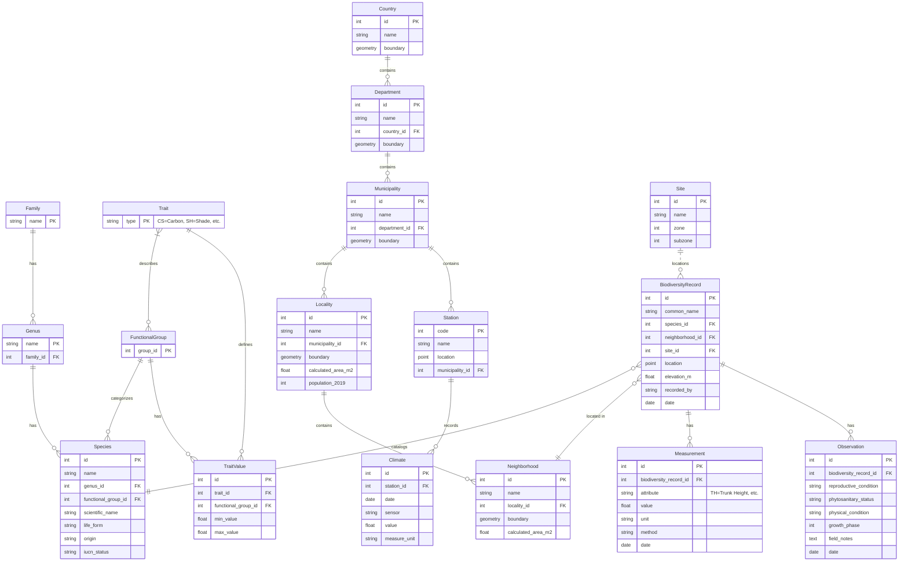

# Database Schema

```mermaid
erDiagram
    %% TAXONOMY MODELS
    Family ||--o{ Genus : "has"
    Genus ||--o{ Species : "has"
    FunctionalGroup ||--o{ Species : "categorizes"
    Trait }|--o{ FunctionalGroup : "describes"
    FunctionalGroup ||--o{ TraitValue : "has"
    Trait ||--o{ TraitValue : "defines"

    %% SPATIAL MODELS
    Country ||--o{ Department : "contains"
    Department ||--o{ Municipality : "contains"
    Municipality ||--o{ Locality : "contains"
    Locality ||--o{ Neighborhood : "contains"
    Site ||..o{ BiodiversityRecord : "locations"

    %% BIODIVERSITY MODELS
    BiodiversityRecord }o--|| Species : "catalogs"
    BiodiversityRecord }o--|| Neighborhood : "located in"

    %% REPORTING MODELS
    BiodiversityRecord ||--o{ Measurement : "has"
    BiodiversityRecord ||--o{ Observation : "has"

    %% CLIMATE MODELS
    Municipality ||--o{ Station : "contains"
    Station ||--o{ Climate : "records"

    %% ENTITY DEFINITIONS
    Family {
        string name PK
    }

    Genus {
        string name PK
        int family_id FK
    }

    Species {
        int id PK
        string name
        int genus_id FK
        int functional_group_id FK
        string scientific_name
        string life_form
        string origin
        string iucn_status
    }

    FunctionalGroup {
        int group_id PK
    }

    Trait {
        string type PK "CS=Carbon, SH=Shade, etc."
    }

    TraitValue {
        int id PK
        int trait_id FK
        int functional_group_id FK
        float min_value
        float max_value
    }

    Country {
        int id PK
        string name
        geometry boundary
    }

    Department {
        int id PK
        string name
        int country_id FK
        geometry boundary
    }

    Municipality {
        int id PK
        string name
        int department_id FK
        geometry boundary
    }

    Locality {
        int id PK
        string name
        int municipality_id FK
        geometry boundary
        float calculated_area_m2
        int population_2019
    }

    Neighborhood {
        int id PK
        string name
        int locality_id FK
        geometry boundary
        float calculated_area_m2
    }

    Site {
        int id PK
        string name
        int zone
        int subzone
    }

    BiodiversityRecord {
        int id PK
        string common_name
        int species_id FK
        int neighborhood_id FK
        int site_id FK
        point location
        float elevation_m
        string recorded_by
        date date
    }

    Measurement {
        int id PK
        int biodiversity_record_id FK
        string attribute "TH=Trunk Height, etc."
        float value
        string unit
        string method
        date date
    }

    Observation {
        int id PK
        int biodiversity_record_id FK
        string reproductive_condition
        string phytosanitary_status
        string physical_condition
        int growth_phase
        text field_notes
        date date
    }

    Station {
        int code PK
        string name
        point location
        int municipality_id FK
    }

    Climate {
        int id PK
        int station_id FK
        date date
        string sensor
        float value
        string measure_unit
    }
```
